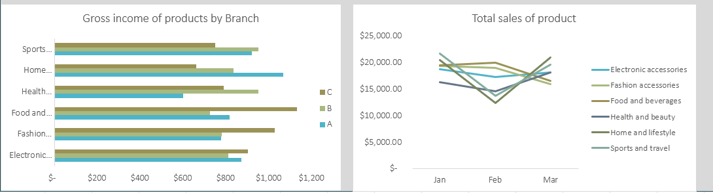

# Supermarket-Sales-Analysis

## Introduction
Every business owner wants their business to thrive. And every business is as good as the profit it makes which most times defines its success of the.  So, in the real world, every profitable business will always stay afloat despite the challenges or stiff competition from others. This analysis delves into the financial capability of a supermarket general sales performances. Despite making sales, they don't generate profits. Emphasis on its profitability with the aim of understanding challenges faced by this organization, providing relative solution to it.
We seek to provide valuable insights tha will drive business growth and profitability, optimize inventory management and contribute to the supermarket success in the competitive industry.

## Data Description
This dataset was provided by The Data Initiative.It is a supermarket sales data that gives a general overview of the company's sales performance.The dataset includes the following:
- Invoice ID: Sales slip invoice identification number.
- Branch: Branch of supercenters where transactions occured(A, B and C).
- City: Location of supercenters(Yangon, Naypitaw, Mandalay).
- Customer Type: Customers with member card(1) and customers without member card(0).
- Gender: Gender of customers( Male and Female).
- Product Category: General product category(Electronic accessories, Fashion accessories, Food and Beverages, Health and Beauty, Home and 
  Lifestyle, Sports and Travel)
- Unit Price: Per unit cost of product.
- Quantity: Number of products purchased.
- Tax: 5% of customer's purchase.
- Total: Total sales of products including Tax.
- Date: Date of purchase(January 2019 - March 2019).
- Time: Purchase time(10am - 9pm).
- Payment: Payment method used by customers for purchase(Cash, Credit card, Ewallet).
- COGS: Cost Of Goods Sold.
- Gross Margin Percentage: Gross Margin Percentage.
- Gross Income: Gross Income.
- Rating: Customer satisfaction rating with overall shopping experience.

  ## The dataset KPIs/Statistics
- Total Sales: $322,967
- Total Gross Income: $55,672
- Total COGS: $307,587
- Total Quantity: 5,510 Items
- Total Cost Price: $55,672
- Count Of Unique Customers: 1000
- Count Of Product Category: 6
- Count Of City: 3

  ## Methodology
  
  ### Data Collection
  This dataset used for this analysis was provided by The Data Initiative. It is a learning organization that helps educate and train data 
  analysts. This analysis is for educational and learning purpose.

  ### Data Manipulation
  #### Data cleaning and Data formatting
   - The dataset didn’t take much time to clean as the errors were very minimal. Firstly, I turned the dataset into a Table using “Ctrl + T”. 
     From the Table Design ribbon, I chose a favorable Table Style.
   - The Gender column had its values abbreviated. It had “FM” and “M”. Using the Find & Replace Function, I replaced “FM” with Female and 
     “M” with Male.
   - The Customer Type column had numbers 1 and 0. Using Find & Replace Function, I replaced “1” with Members and “0” with Normal.
   - I applied Currency Formatting to some of the numbers that denotes monetary value.
   - I checked for Duplicates and there was none. Took a deep breathe because my data is now clean and ready for analysis.

  ### Tool Used
  The software used for this analysis is Microsoft Excel [Download here](https://www.microsoft.com/en-us/microsoft-365/excel)

  ## Dashboard
  

  ## Data Analysis
  ### Customer Insight
  This research tries to understand customer purchasing pattern and demographics. It ehance product marketing and distribution.
  
  ### Insight
  - Mode of payment was highly considered as it influenced customer purchasing ability. Ewallet was the most used mode of payment and Credit card was the least used. Showing how 
    digital mode of payment is getting popular among people.  This may interest you to know that for some customers, the use of credit card for shopping isn’t their strongest suit.
  - Gender purchasing affected their sales. Female customers purchased more items than the male customers. Food and Beverages was the highest selling product as it is an essential. The 
    female customers being the biggest patronizer of this commodity and the male customers settled for Electronic and accessories.
  - Member customers and Normal customers made the highest purchased of product like Food and Beverages. We also discovered that Normal customers are more in number than Member 
    customer.
    
  
  ### Sales
  This seeks to provide detailed analysis on sales within the 3 months period and across various cities.
  
  ### Insight
  - January was a successful month in terms of sales. Sales were at its peak with $110,754. Then it started dwindling in February selling a total of $92,590 and consistently rising in 
  the month of March selling at $104,243. They had a Gross income of $5,538, $4,629 and $5,212 respectively. Despite huge sales made, their gross income is slightly the same across 
  different months.
  - Naypyitaw is the city with the most sales at $110,569 selling 1,831 unit of products. This implies that they prioritised selling high-priced products than any others and set good 
  pricing control measures. 
  - Yangon is the second city with the most sales at $106,200 selling 1,859 unit of products. This shows high sales volume with adequate customer engagement. Having sold more unit of 
  products than Naypyitaw yet couldn't make more sales clearly shows they sold more low-priced products.
  - Mandalay follows closely to Yangon and being the lowest selling city with $106,198 selling 1,820 unit of products. This indicate consistent customer satisfaction and huge buying 
  strength.

  ### Customer satisfaction
  This analysis indicates how customer interest and satisfaction affect the general sales performance.
  
  ### Insight
  - Food and Beverages is the highest selling product at $56,145. Having sold $19,571 in January, $20,000 in Ferbruary and $16,574 in March. Showing huge interest in essentaial 
  products, loyalty and probably referrals. With Sports and Travel follllowing closely to Food and Beverages.
  - Health and beauty is the least selling product at $49,194. Which suggests less patronage from customers and lack of interest. The low output may require a need for customer 
  experience so as to increase customer satisfaction.

  ## Recommendations
  ### Customer Insight
  There is need for optimized marketing strategy to boost customer experience. More attention should be paid to female customers. What they what and how to make them readily available 
  should be paramount. Giving incentives like loyalty awards, free gifts and promotions will enhance customer engagements, satisfaction and increase operational growth.
  
  ### Sales
  - Constant review and analysis of sales performance should be conducted to identify operational deficiency and areas that needs improvement. January sold the most within the 3 months 
  period, showing sales growth and consistent revenue generation. Market promotions, discounted prices and other price control measures should be implemented so as to affect other 
  months where there was low outcome of sales.
  - Market location should also be considered. Some location may not be favorable in terms of customer acquisition or retention. City with large customer base or city that generated 
  more revenue should be prioritized. It clearly shows potential growth and consistent demand of items in those locations.

  ### Customer Insight
  - There is a reason some commodities sold more than the others. This means there should be constant supply of those items, focussing on those customers that wants them.  This will 
  drive general sales performance to a new height. It is essential to optimize a marketing strategy looking into certain products and their performances whether to retain or remove 
  obsolete ones.
  - To retain customer satisfaction, they should be quality delivery service, availability of products when needed. Leveraging on this will boost your customer base and maximize 
  profitability.
  - Promote the use of Ewallet for convenient purposes and to speed up transaction processes.

  ## Conclusion
  With the supermarket facing profitability challenge. It is very essential to seek ways of increasing revenue by taking into consideration all the sales metrics highlighted above 
  and leverage on them. Pay attention to the high selling items and cities, optimise marketing strategies and pricing. Given prominence to these will definitely improve operational 
  performance, keeping you afloat in the business.  
  

  
     
  
  
  
    
  
    
     

